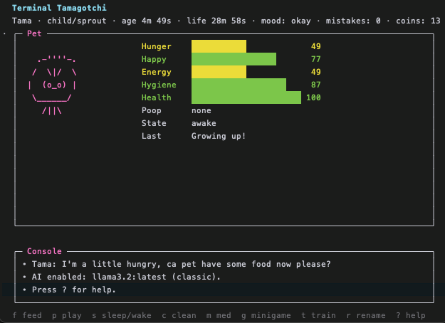

# tama-term

A terminal-based Tamagotchi inspired virtual pet with classic evolution mechanics, stat management, and optional AI personality powered by local Ollama models.



## Features

- **Classic Tamagotchi gameplay**: Feed, play, clean, and care for your pet
- **Evolution system**: Five life stages (egg → baby → child → teen → adult) influenced by your care quality
- **Stats & health**: Track hunger, happiness, health, discipline, and weight
- **Minigame**: Earn coins through a simple guessing game
- **Care mistakes**: Neglect affects evolution outcomes, just like the original
- **Training & discipline**: Build your pet's discipline stat
- **AI integration**: Optional local Ollama chatbot with customizable personalities
- **Auto-save**: Progress automatically saved to disk
- **No dependencies**: Pure Python standard library (AI mode requires Ollama)
- **Adjustable speed**: Control simulation speed for faster gameplay

## Requirements

- Python 3.7+
- Terminal with curses support (standard on macOS/Linux)
- (Optional) [Ollama](https://ollama.ai/) for AI chat mode

## Quick Start

```bash
# Clone or download
git clone <repository-url>
cd tama-term

# Run with default settings
python tama.py
# or
python -m tama

# Or with faster simulation speed
python tama.py --speed 5

# With AI chat enabled
python tama.py --ai
```

## Controls

| Key | Action                      |
| --- | --------------------------- |
| `f` | Feed your pet               |
| `p` | Play with your pet          |
| `s` | Toggle sleep/wake           |
| `c` | Clean up waste              |
| `m` | Give medicine (costs coins) |
| `g` | Play minigame (earn coins)  |
| `t` | Train/discipline            |
| `r` | Rename your pet             |
| `?` | Show help                   |
| `q` | Quit (auto-saves)           |

## Evolution System

Your pet evolves through five stages based on age and care quality:

```
egg → baby → child → teen → adult
```

**Care Mistakes**: Neglecting your pet's needs (letting hunger/happiness drop too low, ignoring sickness, not cleaning waste) accumulates "care mistakes" that influence which adult form your pet evolves into.

**Time Stats**:

- `age`: Real time since hatching
- `life`: Simulated time used for evolution and stat changes (affected by `--speed`)

## Command-Line Options

### Speed Control

Adjust simulation speed (default: 6.0):

```bash
python tama.py --speed 5    # 5x faster
python tama.py --speed 0.5  # Half speed
```

### AI Chat Mode

Enable AI personality with Ollama:

```bash
# Interactive setup wizard
python tama.py --ai

# Specify model directly
python tama.py --ai --ai-model qwen2.5:0.5b
python tama.py --ai --ai-model llama2:7b
```

The setup wizard will:

1. Check if Ollama is installed and running
2. List available models
3. Let you choose a personality (cheerful, grumpy, wise, chaotic, zen)

### Custom Save Location

By default, saves to `~/.tama_state.json`:

```bash
# Use local save file instead
python tama.py --save .tama_state.json

# Custom path
python tama.py --save ~/my-pet-saves/pet1.json
```

## Gameplay Tips

- Check your pet frequently to avoid care mistakes
- Earn coins through the minigame to buy medicine
- Training increases discipline, which can affect evolution
- Each life stage has different needs and behaviors
- Weight increases when overfed, decreases when underfed
- Sickness requires medicine to cure (costs coins)

## Troubleshooting

**AI mode not working?**

- Ensure Ollama is installed: `ollama --version`
- Start Ollama service: `ollama serve`
- Pull a model: `ollama pull qwen2.5:0.5b`

**Terminal display issues?**

- Ensure your terminal window is large enough (min 80x24)
- Try resizing the window if layout looks broken

**Save file not persisting?**

- Check permissions on home directory
- Use `--save` flag to specify a writable location

## License

MIT
